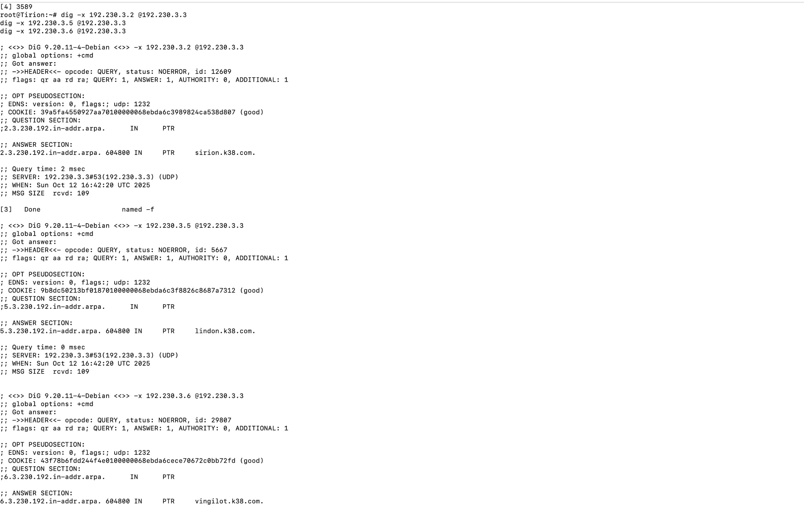
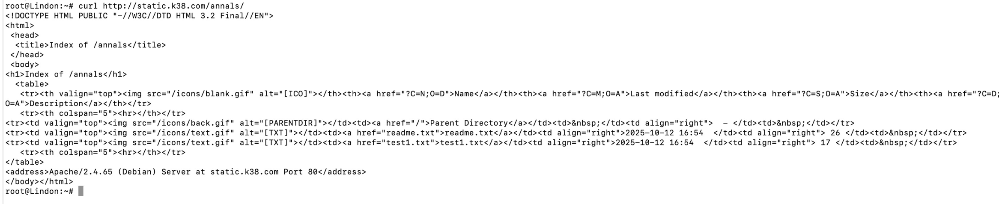

# 📄 Laporan Komdat Jarkom Modul 2 — 2025

## 👥 Anggota Kelompok

| Nama                     | NRP        |
| ------------------------ | ---------- |
| Ahmad Syauqi Reza        | 5027241085 |
| Putri Joselina Silitonga | 5027241116 |

## Deskripsi Laporan 📝

---

# Soal 1

Pada praktikum ini digunakan **GNS3 Web UI** dengan host IP `192.230.1.1`.  
Dibuat sebuah project dengan topologi sebagai berikut:

- Eonwe = panglima/gerbang (router)
- Earendil, Elwing = klien Barat
- Cirdan, Elrond, Maglor = klien Timur
- Sirion = gerbang pelabuhan (reverse proxy)
- Tirion = penjaga nama utama (ns1)
- Valmar = penjaga nama bayangan (ns2)
- Lindon = pelabuhan web statis
- Vingilot = kapal web dinamis
- **Eonwe** merentangkan tiga jalur: Barat untuk **Earendil** dan **Elwing**, Timur untuk **Círdan**, **Elrond**, **Maglor**, serta pelabuhan DMZ bagi **Sirion**, **Tirion**, **Valmar**, **Lindon**, **Vingilot**.
- Router terhubung ke **internet** melalui **NAT1**.
- Router juga terhubung ke **dua switch**.
- Masing-masing switch kemudian menghubungkan **dua client**.

Struktur topologi ini dapat dilihat pada gambar berikut:


# Soal 2

Kita diminta untuk mengkonfigurasi **Eonwe** agar bisa berfungsi seperti router(contoh router wifi), semua perangkat di sekitarnya bisa mengakses internet menggunakan satu koneksi yang sama. Proses ini disebut NAT atau Network Address Translation.

Buat perintah untuk mengizinkan semua jaringan internal untuk "nebeng" ke"" koneksi **Eanwe** ke internet seperti kode berikut :

```
iptables -t nat -A POSTROUTING -o eth0 -j MASQUERADE -s 192.230.0.0/16
```

Sehingga ketika menguji melalui salah satu klien internal, seperti **Cirdan**, maka ketika dilakukan ping 8.8.8.8 (ping google) akan mendapat respons.


# Soal 3

Pada soal ini, kita diminta untuk memverifikasi lagi bahwa semua konfigurasi sudah benar dengan melakukan ping dari klien ke server di jaringan DMZ. Berikut hasil ping dari **Earendil**(Klien Barat) ke **Elrond**(Klien Timur).


Kemudian agar semua perangkat bisa menginstall paket atau mengakses internet via nama domain sejak awal, kita diminta untuk menjalankan perintah seperti berikut:

```
echo "nameserver 192.168.122.1" > /etc/resolv.conf
```

# Soal 4

Pada bagian ini, kita akan mengkonfigurasi DNS Server. Tirion akan berperan sebagai DNS Master (ns1) dan Valmar sebagai DNS Slave (ns2) untuk domain K38.com.

## Konfigurasi DNS Master (Tirion)

1. Instalasi BIND9
   Langkah pertama adalah menginstal paket BIND9 pada Tirion.

```
apt-get update
apt-get install bind9 -y
```

2. Konfigurasi Domain Utama
   Selanjutnya, kita mendefinisikan domain K38.com sebagai master di file /etc/bind/named.conf.local.

```
zone "K38.com" {
    type master;
    file "/etc/bind/[K38.com/ns1.K38.com](https://K38.com/ns1.K38.com)";
};
```

3. Membuat File Zone
   Kita membuat direktori baru untuk menyimpan file konfigurasi domain dan kemudian membuat file zone-nya.

```
mkdir /etc/bind/K38.com
nano /etc/bind/[K38.com/ns1.K38.com](https://K38.com/ns1.K38.com)
```

Isi dari file ns1.K38.com adalah sebagai berikut, yang berisi record SOA, NS (Nameserver), dan A (Address) untuk domain K38.com.

```
$TTL    604800
@       IN      SOA     ns1.K38.com. root.ns1.K38.com. (
                      2025100401 ; Serial
                      604800     ; Refresh
                      86400      ; Retry
                      2419200    ; Expire
                      604800 )   ; Negative Cache TTL
;
@       IN      NS      ns1.K38.com.
@       IN      NS      ns2.K38.com.
@       IN      A       192.230.3.3
@       IN      A       192.230.3.4
```

4. Mengatur Resolver dan Restart Service
   Agar Tirion dapat menggunakan DNS-nya sendiri, kita atur /etc/resolv.conf. Setelah itu, restart layanan BIND9.

### Mengisi /etc/resolv.conf

```
nameserver 192.230.3.3
nameserver 192.230.3.4
```

### Restart BIND9

```
service bind9 restart
```

### Pengujian DNS Master

Pengujian dilakukan dengan melakukan ping ke K38.com dari Tirion. Hasilnya menunjukkan bahwa DNS Master berhasil menerjemahkan nama domain menjadi alamat IP.


## Konfigurasi DNS Slave (Valmar)

1. Perbarui Konfigurasi Master
   Sebelum mengatur slave, kita perlu memperbarui konfigurasi di DNS Master (Tirion) agar mengizinkan transfer data zone ke slave.

```
// /etc/bind/named.conf.local di Tirion
zone "K38.com" {
    type master;
    notify yes;
    also-notify { 192.230.3.4; };
    allow-transfer { 192.230.3.4; };
    file "/etc/bind/[K38.com/ns1.K38.com](https://K38.com/ns1.K38.com)";
};
```

2. Jangan lupa restart BIND9 di Tirion setelah mengubah konfigurasi.

```
service bind9 restart
```

3. Instalasi dan Konfigurasi di Slave
   Sekarang di Valmar, kita install BIND9 dan mengkonfigurasinya sebagai slave.

```
apt-get update
apt-get install bind9 -y
```

4. Kemudian atur file /etc/bind/named.conf.local di Valmar.

```
zone "K38.com" {
    type slave;
    masters { 192.230.3.3; };
    file "/etc/bind/[K38.com/ns1.K38.com](https://K38.com/ns1.K38.com)";
};
```

5. BIND9 akan secara otomatis mengambil data zone dari master. Setelah itu, restart service BIND9 di Valmar.

```
service bind9 restart
```

### Pengujian DNS Slave

Untuk memastikan DNS Slave berfungsi, layanan BIND9 pada DNS Master (Tirion) dimatikan sementara. Kemudian, pengujian ping dilakukan dari klien ke K38.com. Hasilnya menunjukkan bahwa domain K38.com masih dapat diakses, membuktikan bahwa DNS Slave telah mengambil alih tugas resolusi nama domain.


# Soal 5


# Soal 6: Konfigurasi DNS Master-Slave

Konfigurasi **DNS Master-Slave** antara **Tirion (ns1)** sebagai master dan **Valmar (ns2)** sebagai slave untuk domain `k38.com`.

---

### 1. Konfigurasi di Tirion (MASTER)

#### Buat folder zona
```bash
mkdir -p /etc/bind/zones

#### Buat file zona master
nano /etc/bind/zones/db.k38.com 

#### Konfigurasi BIND master
nano /etc/bind/named.conf.local 

#### Restart BIND
pkill named
named -4 -u bind -c /etc/bind/named.conf
```

2. Konfigurasi di Valmar (SLAVE)
#### Persiapan folder
```bash
mkdir -p /var/lib/bind
chown bind:bind /var/lib/bind
```

#### Konfigurasi BIND slave
```bash
nano /etc/bind/named.conf.local

Restart BIND
pkill named
named -4 -u bind -c /etc/bind/named.conf
```

### Verifikasi
Kita bisa liat bahwa Valmar dan Tirion mempunyai SOA yg sama 

## 3.1 Testing Zone Transfer
```bash
dig @192.230.3.3 k38.com AXFR

## 3.2 Cek File Zona di Valmar
ls -l /var/lib/bind/

## 3.3 Verifikasi Serial SOA
#### Di Tirion
dig @192.230.3.3 k38.com SOA

#### Di Valmar  
dig @192.230.3.4 k38.com SOA
```


# No 7

### IP & CNAME Mapping
| Host / Alias        | IP / Canonical Name      |
|-------------------|------------------------|
| sirion.k38.com     | 192.230.3.5 (gateway)  |
| lindon.k38.com     | 192.230.3.6 (web statis) |
| vingilot.k38.com   | 192.230.3.7 (web dinamis) |
| www.k38.com        | sirion.k38.com         |
| static.k38.com     | lindon.k38.com         |
| app.k38.com        | vingilot.k38.com       |


## Langkah Konfigurasi

### 1️⃣ Tirion (MASTER)
1. **Edit file zona**
```bash
nano /etc/bind/zones/db.k38.com
```

### 2️⃣ Valmar (SLAVE)

#### Restart BIND untuk zone transfer

```bash 
pkill named
named -4 -u bind -c /etc/bind/named.conf

#### Verifikasi zone transfer

dig @192.230.3.3 k38.com AXFR
```

### 3️⃣ Verifikasi dari Klien

#### Konfigurasi resolver
```
nano /etc/resolv.conf

Isi:
nameserver 192.230.3.3
nameserver 192.230.3.4
```

#### Test A Records
```bash 
dig sirion.k38.com
dig lindon.k38.com
dig vingilot.k38.com
```


#### Test CNAME Records
``` bash 
dig www.k38.com
dig static.k38.com
dig app.k38.com
```


# Soal 8
Membuat **reverse DNS zone** untuk segmen **192.230.3.0/24** agar pencarian balik IP menampilkan hostname yang benar.

## ⚙️ Konfigurasi
**Tirion (ns1):** 192.230.3.3  
**Valmar (ns2):** 192.230.3.4  
**Reverse Zone:** `3.230.192.in-addr.arpa`


## 🔧 Langkah

### Di Tirion (MASTER)
```bash
mkdir -p /etc/bind/zones
nano /etc/bind/named.conf.local

Isi:

zone "3.230.192.in-addr.arpa" {
  type master;
  file "/etc/bind/zones/db.192.230.3";
  allow-transfer { 192.230.3.4; };
};
```


#### Buat file zona:
```bash 
nano /etc/bind/zones/db.192.230.3

Isi:

$TTL 604800
@ IN SOA ns1.k38.com. root.ns1.k38.com. (2025101201 604800 86400 2419200 604800)
@ IN NS ns1.k38.com.
@ IN NS ns2.k38.com.
2 IN PTR sirion.k38.com.
5 IN PTR lindon.k38.com.
6 IN PTR vingilot.k38.com.
```


#### Validasi & restart:
```bash 
named-checkconf
named-checkzone 3.230.192.in-addr.arpa /etc/bind/zones/db.192.230.3
pkill named
named -f &
```

#### Di Valmar (SLAVE)
```bash 
nano /etc/bind/named.conf.local
Isi:

zone "3.230.192.in-addr.arpa" {
  type slave;
  masters { 192.230.3.3; };
  file "/var/lib/bind/db.192.230.3";
};
```

#### Restart & cek:
```bash pkill named
named -f &
ls -l /var/lib/bind/
```

#### Verifikasi
```bash 
# Resolver
nano /etc/resolv.conf
nameserver 192.230.3.3

# Reverse lookup
dig -x 192.230.3.2
dig -x 192.230.3.5
dig -x 192.230.3.6

# Dari slave
dig -x 192.230.3.2 @192.230.3.4
```


# Soal 9
Menjalankan web statis pada hostname **static.k38.com** dengan folder `/annals/` yang menampilkan *autoindex* agar isinya dapat ditelusuri.

### DNS (Tirion)
```bash
nano /etc/bind/zones/db.k38.com

### Tambah:
static  IN  A  192.230.3.5
```
### Apache (Lindon)
```bash 
apt install apache2 -y
mkdir -p /var/www/static.k38.com/annals
echo "File test" > /var/www/static.k38.com/annals/test.txt

### Virtual host:
<VirtualHost *:80>
 ServerName static.k38.com
 DocumentRoot /var/www/static.k38.com
 <Directory /var/www/static.k38.com/annals>
     Options +Indexes
     Require all granted
 </Directory>
</VirtualHost>
```

### Aktifkan:
```bash 
a2ensite static.k38.com.conf
a2enmod autoindex
apache2ctl restart

### Verifikasi
curl http://static.k38.com/annals/
```


# Soal 10
Menjalankan web dinamis (PHP-FPM) pada hostname app.k38.com dengan beranda dan halaman about, serta menerapkan rewrite sehingga /about berfungsi tanpa akhiran .php.

### DNS (Tirion)
```bash 
nano /etc/bind/zones/db.k38.com

Tambah:
app  IN  A  192.230.3.6
``` 
### Apache & PHP-FPM (Vingilot)
```bash 
apt install apache2 php-fpm -y
a2enmod proxy_fcgi setenvif rewrite
a2enconf php8.4-fpm
service apache2 reload

### File web:
mkdir -p /var/www/app.k38.com
echo "<h1>Selamat datang di App K38</h1>" > /var/www/app.k38.com/index.php
echo "<h1>Ini halaman About</h1>" > /var/www/app.k38.com/about.php
```
### Virtual host:
```bash 
<VirtualHost *:80>
 ServerName app.k38.com
 DocumentRoot /var/www/app.k38.com
 <Directory /var/www/app.k38.com>
     AllowOverride All
     Require all granted
 </Directory>
</VirtualHost>
```
### .htaccess:
```bash
RewriteEngine On
RewriteRule ^about$ about.php [L]
```
### Verifikasi
```bash
curl http://app.k38.com/
curl http://app.k38.com/about
```
#foto10

# Soal 11 
Konfigurasi **Reverse Proxy** di **Sirion (192.230.3.2)** agar:
- `/static` → diarahkan ke **Lindon (192.230.3.5)**
- `/app` → diarahkan ke **Vingilot (192.230.3.6)**


## Langkah Konfigurasi

### 1. Konfigurasi DNS di Tirion
```bash
nano /etc/bind/zones/db.k38.com
```
### Tambahkan:
```bash
www    IN  CNAME   sirion.k38.com.
sirion IN  A       192.230.3.2

### Lalu validasi & restart:
named-checkzone k38.com /etc/bind/zones/db.k38.com
service bind9 restart
```

### 2. Konfigurasi Apache di Sirion
#### Install & aktifkan modul:
```bash
apt update && apt install apache2 -y
a2enmod proxy proxy_http headers
service apache2 restart
```

### Buat file virtual host:
```bash
nano /etc/apache2/sites-available/sirion-proxy.conf
Isi:
<VirtualHost *:80>
    ServerName www.k38.com
    ServerAlias sirion.k38.com

    ErrorLog ${APACHE_LOG_DIR}/sirion_error.log
    CustomLog ${APACHE_LOG_DIR}/sirion_access.log combined

    # Proxy untuk /static → Lindon
    ProxyPass /static/ http://192.230.3.5/
    ProxyPassReverse /static/ http://192.230.3.5/

    # Proxy untuk /app → Vingilot
    ProxyPass /app/ http://192.230.3.6/
    ProxyPassReverse /app/ http://192.230.3.6/

    ProxyPreserveHost On
    RequestHeader set X-Real-IP %{REMOTE_ADDR}s
</VirtualHost>
``` 

### Aktifkan:
```bash 
a2dissite 000-default.conf
a2ensite sirion-proxy.conf
service apache2 restart
``` 

### Verifikasi Soal 11
```bash
dig www.k38.com +short
# → 192.230.3.2

curl -s http://www.k38.com/static/annals/ | head -5
# → Directory listing dari Lindon

curl -s http://www.k38.com/app/
# → <h1>Selamat datang di App K38</h1>
```


Soal 12 
Menambahkan Basic Authentication di Sirion agar akses /admin hanya bisa dilakukan oleh user admin dengan password ainur.

⚙️ Langkah Konfigurasi
### 1. Buat File Password
```bash
apt install apache2-utils -y
htpasswd -bc /etc/apache2/.htpasswd admin ainur
cat /etc/apache2/.htpasswd
```

### 2. Tambahkan Konfigurasi Basic Auth
Edit virtual host:
```bash
nano /etc/apache2/sites-available/sirion-proxy.conf
```

Tambahkan di dalam <VirtualHost>:
```bash
<Location /admin>
    AuthType Basic
    AuthName "Restricted Admin Area"
    AuthUserFile /etc/apache2/.htpasswd
    Require valid-user

    ProxyPass http://192.230.3.6/
    ProxyPassReverse http://192.230.3.6/
</Location>

### Restart:
```bash 
service apache2 restart
``` 

3. Buat Halaman Admin di Vingilot
```bash 
mkdir -p /var/www/html/admin
echo "<h1>Admin Area - Akses Berhasil!</h1>" > /var/www/html/admin/index.html
service apache2 restart
```

### Verifikasi Soal 12
#### Tanpa kredensial (401 Unauthorized):
```bash
curl -I http://www.k38.com/admin/
#### HTTP/1.1 401 Unauthorized
```
```bash
#### Dengan kredensial benar (200 OK):
curl -u admin:ainur -I http://www.k38.com/admin/
# HTTP/1.1 200 OK
```


## Soal 13

###  Langkah Konfigurasi
#### 1. Pastikan Backend Berjalan
```bash
# DI LINDON (192.230.3.5)
service apache2 restart
curl -I http://192.230.3.5

# DI VINGILOT (192.230.3.6)
service apache2 restart
curl -I http://192.230.3.6
```

### 2. Install dan Jalankan Nginx di Sirion
```bash apt update
apt install nginx -y
service apache2 stop
service nginx start
service nginx status
```

### 3. Buat Konfigurasi Kanonisasi
```bash 
nano /etc/nginx/sites-available/k38.com

# Server block untuk www.k38.com (kanonik)
server {
    listen 80;
    server_name www.k38.com;

    # Routing
    location /static/ { proxy_pass http://192.230.3.5/; }
    location /app/    { proxy_pass http://192.230.3.6/; }

    # Basic Auth
    location /admin/ {
        auth_basic "Admin Login";
        auth_basic_user_file /etc/nginx/.htpasswd;
        proxy_pass http://192.230.3.6/;
    }

    # Redirect root ke /static/
    location = / { return 302 /static/; }
}

# Redirect non-kanonik ke www.k38.com
server {
    listen 80;
    server_name sirion.k38.com 192.230.3.2;
    return 301 http://www.k38.com$request_uri;
}
```

### 4. Setup Basic Auth
```bash 
apt install apache2-utils -y
htpasswd -bc /etc/nginx/.htpasswd admin ainur
mkdir -p /var/www/html/admin
echo "<h1>Welcome to Admin Panel</h1>" > /var/www/html/admin/index.html
``` 

### 5. Aktifkan Konfigurasi
```bash
rm /etc/nginx/sites-enabled/default
ln -s /etc/nginx/sites-available/k38.com /etc/nginx/sites-enabled/
nginx -t
service nginx reload
```

### Verifikasi
### Redirect test
```bash 
curl -I http://sirion.k38.com/static/
curl -I http://192.230.3.2/app/
curl -I http://www.k38.com/

### Expected Output
HTTP/1.1 301 Moved Permanently
Location: http://www.k38.com/static/
```


Soal 14
Langkah Konfigurasi
### 1. Install Nginx & PHP-FPM
```bash 
apt update
apt install nginx php-fpm -y
```

### 2. Buat Aplikasi Testing
```bash 
mkdir -p /var/www/app
nano /var/www/app/index.php

<?php
echo "<h1>Vingilot reporting in!</h1>";
echo "<p>Your IP: " . $_SERVER['REMOTE_ADDR'] . "</p>";
echo "<p>X-Real-IP: " . ($_SERVER['HTTP_X_REAL_IP'] ?? 'Not set') . "</p>";
echo "<p>X-Forwarded-For: " . ($_SERVER['HTTP_X_FORWARDED_FOR'] ?? 'Not set') . "</p>";
?>
```

### 3. Konfigurasi Nginx (Vingilot)
```bash 
nano /etc/nginx/sites-available/app

isi dengan

server {
    listen 80;
    server_name vingilot.k38.com app.k38.com;
    root /var/www/app;
    index index.php;

    set_real_ip_from 192.230.3.2;
    real_ip_header X-Real-IP;

    log_format realip '$http_x_real_ip - $remote_user [$time_local] "$request" $status';
    access_log /var/log/nginx/access.log realip;

    location / { try_files $uri $uri/ =404; }
    location ~ \.php$ {
        include snippets/fastcgi-php.conf;
        fastcgi_pass unix:/run/php/php8.4-fpm.sock;
    }
}
``` 

### 4. Aktifkan & Restart
```bash 
ln -s /etc/nginx/sites-available/app /etc/nginx/sites-enabled/
rm /etc/nginx/sites-enabled/default
nginx -t
service php8.4-fpm start
service nginx restart
```

### 5. Update Sirion agar Kirim Header
```bash 
nano /etc/nginx/sites-available/k38.com

### Tambahkan di block /app/:
```bash 
proxy_set_header X-Real-IP $remote_addr;

Lalu:
service nginx reload
```

### Verifikasi
```
### Dari klien
curl http://www.k38.com/app/

### Cek log di Vingilot
tail -f /var/log/nginx/access.log
Expected: Log menampilkan IP asli klien (X-Real-IP), bukan IP Sirion.

192.230.1.10 - - [time] "GET /app/" 200
```


# No 15 
Pada percobaan ini, dilakukan **pengujian performa Reverse Proxy berbasis path** menggunakan **ApacheBench (ab)** dari node **Elrond (192.230.2.4)**.  
Pengujian dilakukan terhadap dua endpoint:

- `/app` → diteruskan ke **Vingilot (192.230.3.6)** (server aplikasi PHP)
- `/static` → diteruskan ke **Lindon (192.230.3.4)** (server file statis)

Masing-masing endpoint diuji sebanyak **500 request** dengan **10 concurrency** untuk mengukur stabilitas dan performa.

---

## Alur Request

```text
Elrond (192.230.2.4)
        ↓
Sirion (192.230.3.2) - Reverse Proxy
        ↓
    /static/ → Lindon (192.230.3.4)
    /app/    → Vingilot (192.230.3.6)
```

## Perintah di Node Elrond
#### Install ApacheBench
```bash 
apt-get update && apt-get install -y apache2-utils

#### Uji endpoint /app
ab -n 500 -c 10 http://www.k38.com/app/

#### Uji endpoint /static
ab -n 500 -c 10 http://www.k38.com/static/
```

## 📊 Hasil Pengujian ApacheBench

| Endpoint | Server Software | Complete Requests | Failed Requests | Time Taken (s) | Requests/sec | Time per Request (ms) | Transfer Rate (KB/sec) |
|-----------|------------------|-------------------|------------------|----------------|---------------|------------------------|--------------------------|
| `/app`    | nginx/1.11.5     | 500               | 0                | 17.465         | 28.34         | 35.991                 | 51.67                    |
| `/static` | nginx/1.11.5     | 500               | 0                | 17.639         | 28.35         | 35.279                 | 51.99                    |


📈 Analisis
Semua request berhasil dijalankan tanpa error (0 failed requests).

Nilai Requests/sec hampir sama antara /app dan /static, menunjukkan load balancing berjalan stabil.

Endpoint /static sedikit lebih cepat karena hanya melayani konten statis.

Transfer rate konsisten (~51 KB/sec), menunjukkan performa jaringan dan proxy yang optimal.

Hasil ini membuktikan bahwa path-based routing di Nginx (Sirion) berfungsi dengan baik, membagi beban ke dua backend server tanpa hambatan.


