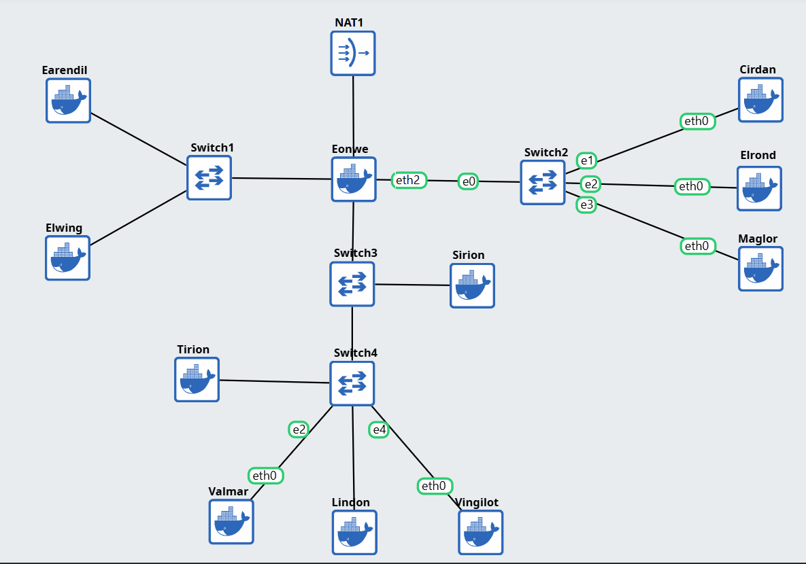

# 📄 Laporan Komdat Jarkom Modul 2 — 2025

## 👥 Anggota Kelompok

| Nama                     | NRP        |
| ------------------------ | ---------- |
| Ahmad Syauqi Reza        | 5027241085 |
| Putri Joselina Silitonga | 5027241116 |

## Deskripsi Laporan 📝

---

# Soal 1

Pada praktikum ini digunakan **GNS3 Web UI** dengan host IP `192.230.1.1`.  
Dibuat sebuah project dengan topologi sebagai berikut:

- Eonwe = panglima/gerbang (router)
- Earendil, Elwing = klien Barat
- Cirdan, Elrond, Maglor = klien Timur
- Sirion = gerbang pelabuhan (reverse proxy)
- Tirion = penjaga nama utama (ns1)
- Valmar = penjaga nama bayangan (ns2)
- Lindon = pelabuhan web statis
- Vingilot = kapal web dinamis
- **Eonwe** merentangkan tiga jalur: Barat untuk **Earendil** dan **Elwing**, Timur untuk **Círdan**, **Elrond**, **Maglor**, serta pelabuhan DMZ bagi **Sirion**, **Tirion**, **Valmar**, **Lindon**, **Vingilot**.
- Router terhubung ke **internet** melalui **NAT1**.
- Router juga terhubung ke **dua switch**.
- Masing-masing switch kemudian menghubungkan **dua client**.

Struktur topologi ini dapat dilihat pada gambar berikut:



# Soal 2

Kita diminta untuk mengkonfigurasi **Eonwe** agar bisa berfungsi seperti router(contoh router wifi), semua perangkat di sekitarnya bisa mengakses internet menggunakan satu koneksi yang sama. Proses ini disebut NAT atau Network Address Translation.

Buat perintah untuk mengizinkan semua jaringan internal untuk "nebeng" ke"" koneksi **Eanwe** ke internet seperti kode berikut :

```
iptables -t nat -A POSTROUTING -o eth0 -j MASQUERADE -s 192.230.0.0/16
```

Sehingga ketika menguji melalui salah satu klien internal, seperti **Cirdan**, maka ketika dilakukan ping 8.8.8.8 (ping google) akan mendapat respons.


# Soal 3

Pada soal ini, kita diminta untuk memverifikasi lagi bahwa semua konfigurasi sudah benar dengan melakukan ping dari klien ke server di jaringan DMZ. Berikut hasil ping dari **Earendil**(Klien Barat) ke **Elrond**(Klien Timur).


Kemudian agar semua perangkat bisa menginstall paket atau mengakses internet via nama domain sejak awal, kita diminta untuk menjalankan perintah seperti berikut:

```
echo "nameserver 192.168.122.1" > /etc/resolv.conf
```

# Soal 4

Pada bagian ini, kita akan mengkonfigurasi DNS Server. Tirion akan berperan sebagai DNS Master (ns1) dan Valmar sebagai DNS Slave (ns2) untuk domain K38.com.

## Konfigurasi DNS Master (Tirion)

1. Instalasi BIND9
   Langkah pertama adalah menginstal paket BIND9 pada Tirion.

```
apt-get update
apt-get install bind9 -y
```

2. Konfigurasi Domain Utama
   Selanjutnya, kita mendefinisikan domain K38.com sebagai master di file /etc/bind/named.conf.local.

```
zone "K38.com" {
    type master;
    file "/etc/bind/[K38.com/ns1.K38.com](https://K38.com/ns1.K38.com)";
};
```

3. Membuat File Zone
   Kita membuat direktori baru untuk menyimpan file konfigurasi domain dan kemudian membuat file zone-nya.

```
mkdir /etc/bind/K38.com
nano /etc/bind/[K38.com/ns1.K38.com](https://K38.com/ns1.K38.com)
```

Isi dari file ns1.K38.com adalah sebagai berikut, yang berisi record SOA, NS (Nameserver), dan A (Address) untuk domain K38.com.

```
$TTL    604800
@       IN      SOA     ns1.K38.com. root.ns1.K38.com. (
                      2025100401 ; Serial
                      604800     ; Refresh
                      86400      ; Retry
                      2419200    ; Expire
                      604800 )   ; Negative Cache TTL
;
@       IN      NS      ns1.K38.com.
@       IN      NS      ns2.K38.com.
@       IN      A       192.230.3.3
@       IN      A       192.230.3.4
```

4. Mengatur Resolver dan Restart Service
   Agar Tirion dapat menggunakan DNS-nya sendiri, kita atur /etc/resolv.conf. Setelah itu, restart layanan BIND9.

### Mengisi /etc/resolv.conf

```
nameserver 192.230.3.3
nameserver 192.230.3.4
```

### Restart BIND9

```
service bind9 restart
```

### Pengujian DNS Master

Pengujian dilakukan dengan melakukan ping ke K38.com dari Tirion. Hasilnya menunjukkan bahwa DNS Master berhasil menerjemahkan nama domain menjadi alamat IP.


## Konfigurasi DNS Slave (Valmar)

1. Perbarui Konfigurasi Master
   Sebelum mengatur slave, kita perlu memperbarui konfigurasi di DNS Master (Tirion) agar mengizinkan transfer data zone ke slave.

```
// /etc/bind/named.conf.local di Tirion
zone "K38.com" {
    type master;
    notify yes;
    also-notify { 192.230.3.4; };
    allow-transfer { 192.230.3.4; };
    file "/etc/bind/[K38.com/ns1.K38.com](https://K38.com/ns1.K38.com)";
};
```

2. Jangan lupa restart BIND9 di Tirion setelah mengubah konfigurasi.

```
service bind9 restart
```

3. Instalasi dan Konfigurasi di Slave
   Sekarang di Valmar, kita install BIND9 dan mengkonfigurasinya sebagai slave.

```
apt-get update
apt-get install bind9 -y
```

4. Kemudian atur file /etc/bind/named.conf.local di Valmar.

```
zone "K38.com" {
    type slave;
    masters { 192.230.3.3; };
    file "/etc/bind/[K38.com/ns1.K38.com](https://K38.com/ns1.K38.com)";
};
```

5. BIND9 akan secara otomatis mengambil data zone dari master. Setelah itu, restart service BIND9 di Valmar.

```
service bind9 restart
```

### Pengujian DNS Slave

Untuk memastikan DNS Slave berfungsi, layanan BIND9 pada DNS Master (Tirion) dimatikan sementara. Kemudian, pengujian ping dilakukan dari klien ke K38.com. Hasilnya menunjukkan bahwa domain K38.com masih dapat diakses, membuktikan bahwa DNS Slave telah mengambil alih tugas resolusi nama domain.


# Soal 5
